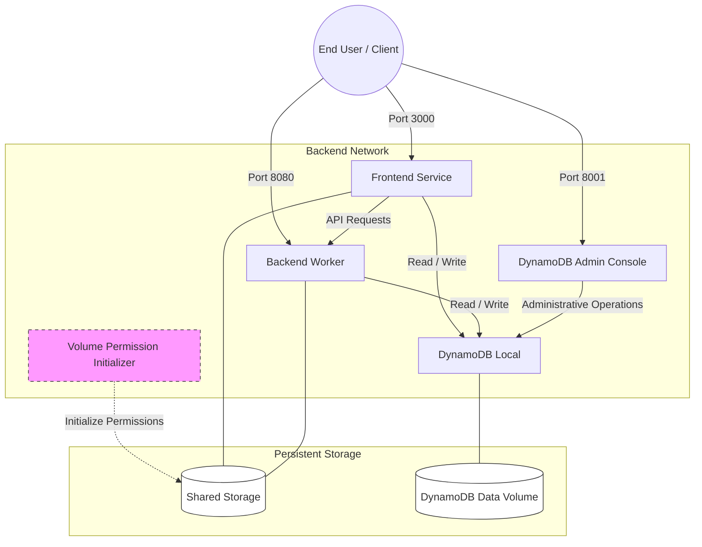

# System Architecture

```mermaid
graph TD
    %% Backend Network
    subgraph backend_network [Backend Network]
        %% Core Services
        FE[Frontend Service]
        BE[Backend Worker]
        DB[DynamoDB Local]
        DBA[DynamoDB Admin Console]
        VF[Volume Permission Initializer]
    end

    %% Storage Volumes
    subgraph storage [Persistent Storage]
        SS[(Shared Storage)]
        DD[(DynamoDB Data Volume)]
    end

    %% External Access Points
    User((End User / Client)) -->|Port 3000| FE
    User -->|Port 8080| BE
    User -->|Port 8001| DBA

    %% Service Interactions
    FE -->|API Requests| BE
    FE -->|Read / Write| DB
    BE -->|Read / Write| DB
    DBA -->|Administrative Operations| DB

    %% Volume Mounts
    VF -.->|Initialize Permissions| SS
    FE --- SS
    BE --- SS
    DB --- DD

    %% Styling
    style VF fill:#f9f,stroke:#333,stroke-dasharray: 5 5
    style SS fill:#fff,stroke:#333
    style DD fill:#fff,stroke:#333
```
